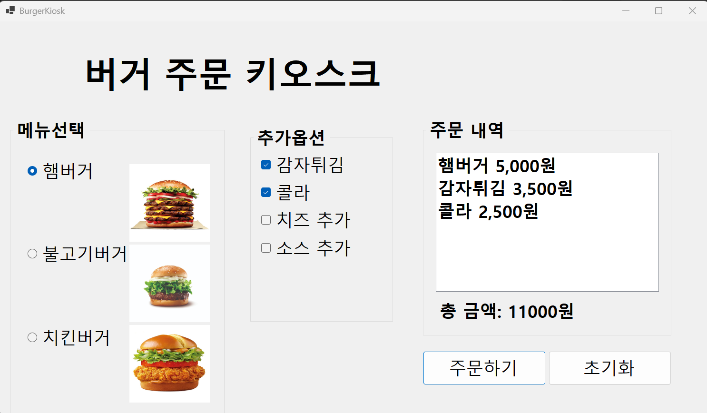
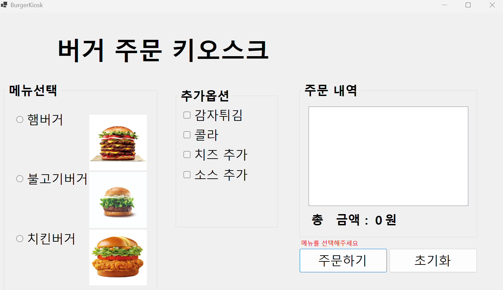

# (C# 코딩) 버거 키오스크

## 개요

- 1줄 소개: 버거가게 키오스크를 만들었습니다

- 사용한 플랫폼:
 - C#, .NET Windows Forms, Visual Stdio, GitHub
- 사용한 컨트롤:
 - CheckBox, RadioButton, Label, Button, GroupBox, ListBox

- 사용한 기술과 구현한 기능:
- RadioButton을 활용한 단일 메뉴 선택 기능 구현
- CheckBox를 활용한 복수선택 처리 기능 구현
- 선택된 항목들의 가격을 합산 기능 구현
- 버튼 클릭 시 전체 로직 실행
- 선택 여부에 따른 분기처리

## 실행 화면 (과제1)
- 과제1 코드의 실행 스크린샷

- 과제 내용
- UI 구성
- RadioButton과 CheckBox 등을 적절히 배치
- GroupBox로 적적하게 그룹으로 묶기
- 주문 내역과 총 금액 표시하기
- 다시 주문할 수 있도록 초기화하기

- 구현 내용과 기능 설명
- CheckBox, RadioButton, Label, Button, GroupBox를 적절히 배치
- 주문 내역을 ListBox에 정렬 및 출력하도록 구현
- 선택된 총 주문 가격을 Label에 출력하도록 구현
- 초기화 버튼을 눌렀을 때 모든 선택을 초기화 하도록 구현

## 실행 화면 (과제2)
- 과제 2 코드의 실행 스크린샷

- 과제 내용
 - 아무것도 선택하지 않고 주문하기 버튼을 누르면 에러 메시지 표시

- 구현 내용과 기능 설명
 - Label을 적절히 배치하고 눈에 띠도록 빨간색으로 강조함
 - Label을 이용하여 아무것도 선택하지 않고 주문하기 버튼을 누를 시에 “메뉴를 선택하세요.”라는 에러 메시지 표시하도록 구현 
